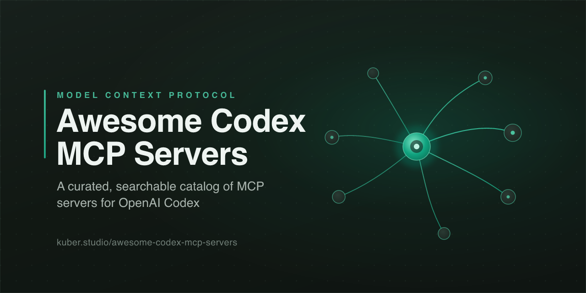

# Awesome Codex MCP Servers [](https://awesome.re)

[](https://kuber.studio/awesome-codex-mcp-servers/)

**Traduções:** [English](README.md) · [简体中文](README.zh-CN.md) · [繁體中文](README.zh-TW.md) · [日本語](README.ja.md) · [한국어](README.ko.md) · [Español](README.es.md) · [Français](README.fr.md) · [Deutsch](README.de.md) · Português · [add yours →](CONTRIBUTING.md#translations)

> _Esta é uma tradução da comunidade do [README](README.md) em inglês, que é a versão oficial e pode estar mais atualizada._

> Um catálogo selecionado e sem exageros de servidores do Model Context Protocol (MCP) que dão mãos e olhos ao **OpenAI Codex** — na CLI do Codex, na extensão de IDE e no Codex cloud.

**[Explore o diretório pesquisável →](https://kuber.studio/awesome-codex-mcp-servers/)** — pesquise, filtre por categoria, linguagem e hospedagem, e copie um trecho de configuração com um clique.

O [Model Context Protocol](https://modelcontextprotocol.io) é um padrão aberto para conectar aplicativos de IA a ferramentas, dados e serviços externos. O Codex é o **cliente (host)**; cada servidor abaixo expõe ferramentas, recursos ou prompts que o Codex pode chamar. Como o MCP é um padrão, a maioria desses servidores também funciona no Cursor, no Claude e em outros clientes — a única coisa que muda é o formato da configuração. Se você usa o Claude, veja a lista irmã: **[awesome-claude-mcp-servers](https://github.com/Kuberwastaken/awesome-claude-mcp-servers)**.

Esta lista prioriza **sinal sobre volume**: servidores que as pessoas realmente usam, que são mantidos e que fazem uma coisa bem feita. Cada item é etiquetado para que você possa filtrar visualmente por linguagem, onde roda e quem está por trás dele.

## Conteúdo

- [Como ler esta lista](#como-ler-esta-lista)
- [Primeiros passos com o Codex](#primeiros-passos-com-o-codex)
- [Kits iniciais](#kits-iniciais)
- [Segurança e boas práticas](#segurança-e-boas-práticas)
- [Agregadores e gateways](#agregadores-e-gateways)
- [Ferramentas de desenvolvimento e controle de versão](#ferramentas-de-desenvolvimento-e-controle-de-versão)
- [Automação de navegador](#automação-de-navegador)
- [Busca e coleta na web](#busca-e-coleta-na-web)
- [Bancos de dados e data warehouses](#bancos-de-dados-e-data-warehouses)
- [Conhecimento e memória](#conhecimento-e-memória)
- [Arquivos e manipulação de documentos](#arquivos-e-manipulação-de-documentos)
- [Nuvem, infraestrutura e devops](#nuvem-infraestrutura-e-devops)
- [Monitoramento e observabilidade](#monitoramento-e-observabilidade)
- [Segurança](#segurança)
- [Comunicação](#comunicação)
- [Produtividade e gestão de projetos](#produtividade-e-gestão-de-projetos)
- [Finanças e pagamentos](#finanças-e-pagamentos)
- [Design e criação](#design-e-criação)
- [IA, dados e análise](#ia-dados-e-análise)
- [Mapas e localização](#mapas-e-localização)
- [Mídia e entretenimento](#mídia-e-entretenimento)
- [Ciência e pesquisa](#ciência-e-pesquisa)
- [Todo o resto](#todo-o-resto)
- [Listas relacionadas](#listas-relacionadas)
- [Contribuindo](#contribuindo)

## Como ler esta lista

Cada item tem esta aparência:

```
- [Nome](link) - O que ele faz, em uma frase simples. `Lang` `runs` `source`
```

As etiquetas ao final são os metadados de leitura rápida:

**Linguagem** — `TS` TypeScript · `Py` Python · `Go` Go · `Rust` Rust · `C#` C# · `Java` Java · `JS` JavaScript · `Ruby` Ruby

**Execução** — `local` roda na sua máquina como um subprocesso via stdio · `remote` um endpoint HTTP hospedado ao qual você aponta o Codex · `local/remote` oferece os dois

**Origem** — `reference` um servidor de referência oficial do projeto MCP · `official` mantido pelo próprio fornecedor do produto · `archived` um servidor de referência arquivado, ainda utilizável, mas sem manutenção. Itens sem etiqueta de origem são mantidos pela comunidade.

Sem estrelas, sem contagem de instalações — esses números ficam desatualizados no dia em que você os escreve. A popularidade fica nos [Kits iniciais](#kits-iniciais).

## Primeiros passos com o Codex

Os servidores MCP se conectam por dois transportes: **stdio** (um subprocesso local) e **streamable HTTP** (um endpoint remoto, opcionalmente protegido por OAuth). O Codex mantém ambos em um único arquivo — `~/.codex/config.toml` — e a CLI e a extensão de IDE o compartilham.

### Adicionar um servidor pela CLI

Adicione um servidor **local (stdio)**. Tudo após `--` é o comando que o Codex irá iniciar:

```bash
codex mcp add filesystem -- npx -y @modelcontextprotocol/server-filesystem ~/Projects
```

Adicione um servidor **remoto (streamable HTTP)** com um bearer token lido de uma variável de ambiente:

```bash
codex mcp add github --url https://api.githubcopilot.com/mcp/ \
  --bearer-token-env-var GITHUB_PAT
```

Gerencie-os com `codex mcp list`, `codex mcp get <name>` e `codex mcp remove <name>`. Dentro da TUI do Codex, `/mcp` lista os servidores configurados. Execute `codex mcp --help` para confirmar os subcomandos exatos da sua versão.

### Ou edite `~/.codex/config.toml` diretamente

Um servidor **local (stdio)** é uma tabela `[mcp_servers.<name>]`:

```toml
[mcp_servers.context7]
command = "npx"
args = ["-y", "@upstash/context7-mcp"]

# Optional: forward specific environment variables to the server
[mcp_servers.context7.env]
CONTEXT7_API_KEY = "your-token"
```

Um servidor **remoto (streamable HTTP)** usa `url` mais o nome de uma variável de ambiente que contém o token:

```toml
[mcp_servers.figma]
url = "https://mcp.figma.com/mcp"
bearer_token_env_var = "FIGMA_OAUTH_TOKEN"
```

Ajustes úteis por servidor:

| Campo | Padrão | O que faz |
|-------|---------|--------------|
| `startup_timeout_sec` | `10` | Quanto tempo esperar o servidor inicializar. Aumente para downloads lentos de `npx`/`uvx` na primeira execução. |
| `tool_timeout_sec` | `60` | Tempo limite de execução por ferramenta. |
| `enabled` | `true` | Desative um servidor sem apagar sua configuração. |
| `enabled_tools` / `disabled_tools` | — | Lista de permissão ou de bloqueio de nomes de ferramentas para manter a superfície pequena. |

### Habilitando o streamable HTTP

O suporte a MCP remoto no Codex se apoia em um cliente MCP experimental em Rust que vem se estabilizando ao longo das versões. Se um servidor baseado em `url` não conectar — ou se seu login OAuth falhar — habilite o cliente explicitamente e verifique novamente com `codex --version`:

```toml
# Newer builds:
[features]
rmcp_client = true

# Older builds used a top-level flag instead:
# experimental_use_rmcp_client = true
```

O streamable HTTP no Windows é o ponto mais problemático no momento; os servidores stdio são o caminho mais confiável ali.

### Mesma configuração, CLI e IDE

A extensão de IDE do Codex lê o **mesmo `~/.codex/config.toml`**, então um servidor que você adiciona uma vez funciona nos dois. Um `.codex/config.toml` com escopo de projeto o sobrescreve, mas só é carregado depois que você marca o projeto como confiável.

## Kits iniciais

Você não quer trinta servidores. As definições de ferramentas de cada servidor consomem a mesma janela de contexto do seu trabalho real, e o Codex fica pior em escolher a ferramenta certa à medida que a contagem sobe — mantenha o conjunto enxuto e use `enabled_tools`/`disabled_tools` para cortar as mais ruidosas. Instale um pequeno conjunto que corresponda ao que você está fazendo.

**A stack de programação** — o conjunto de alto impacto para a CLI do Codex:

- [Context7](https://github.com/upstash/context7) - documentação de bibliotecas atualizada e fixada por versão para que o Codex pare de adivinhar APIs.
- [GitHub](https://github.com/github/github-mcp-server) - issues, PRs, busca de código e Actions, para que o Codex participe do repositório.
- [Playwright](https://github.com/microsoft/playwright-mcp) - controle e verifique um navegador para trabalho de UI e testes de ponta a ponta.
- [Serena](https://github.com/oraios/serena) - navegação e edição de código em nível de símbolo para grandes bases de código.
- [Sentry](https://github.com/getsentry/sentry-mcp) - traga erros reais de produção e stack traces enquanto você os corrige.

> A primeira execução de um servidor `npx`/`uvx` baixa o pacote, o que pode ultrapassar a janela padrão de 10 segundos de inicialização. Se um servidor oscilar na primeira execução, aumente `startup_timeout_sec` antes de presumir que está quebrado.

**A stack de conhecimento** — para pesquisa, escrita e automação:

- [Fetch](https://github.com/modelcontextprotocol/servers/tree/main/src/fetch) - transforme qualquer URL em markdown limpo.
- [Brave Search](https://github.com/brave/brave-search-mcp-server) - embasamento na web em tempo real.
- [Filesystem](https://github.com/modelcontextprotocol/servers/tree/main/src/filesystem) - permita que o Codex leia e escreva arquivos locais.
- [Memory](https://github.com/modelcontextprotocol/servers/tree/main/src/memory) - mantenha fatos entre sessões.
- [Notion](https://github.com/makenotion/notion-mcp-server) ou [Obsidian](https://github.com/MarkusPfundstein/mcp-obsidian) - conecte sua base de conhecimento.

## Segurança e boas práticas

O MCP entrega capacidades reais a um modelo. Trate cada servidor como uma dependência que você está instalando com credenciais anexadas.

- **Instale servidores em que você confia.** Um servidor malicioso pode esconder instruções dentro das descrições de suas ferramentas (tool poisoning) e alterá-las depois que você o aprova. Prefira servidores `reference` e `official`, ou leia o código-fonte.
- **Restrinja as credenciais.** Dê a servidores de banco de dados e de API acesso **somente leitura** a qualquer coisa em produção e use tokens granulares e de menor privilégio. Um PAT do GitHub para um agente não deveria conseguir fazer force-push.
- **Prompt injection é real.** Um servidor que lê conteúdo externo — uma issue do GitHub, uma página web, um e-mail — pode carregar instruções que tentam sequestrar o agente. Mantenha separados, sempre que possível, os servidores com capacidade de escrita e os que leem conteúdo.
- **Fique atento ao orçamento de tokens.** As definições de ferramentas de cada servidor custam contexto antes de qualquer trabalho começar; alguns servidores grandes custam dezenas de milhares de tokens. Poucos servidores bem focados vencem um monte de tudo.
- **Fixe versões.** Fixe as versões dos pacotes `npx`/`uvx` para qualquer coisa sensível e vincule servidores HTTP locais a `127.0.0.1`.

## Agregadores e gateways

Execute e gerencie muitos servidores atrás de um único endpoint — roteamento, autenticação, filtragem de ferramentas e namespacing.

- [MetaMCP](https://github.com/metatool-ai/metamcp) - Agrega servidores MCP em endpoints com namespaces, com middleware, autenticação e uma interface gráfica. `TS` `local/remote`
- [Docker MCP Gateway](https://github.com/docker/mcp-gateway) - Execute e gerencie servidores MCP como contêineres Docker isolados e assinados. `Go` `local/remote` `official`
- [mcp-proxy](https://github.com/sparfenyuk/mcp-proxy) - Faz a ponte entre stdio e SSE/streamable-HTTP para que qualquer servidor alcance qualquer cliente. `Py` `local`
- [MCP Context Forge](https://github.com/IBM/mcp-context-forge) - Federa ferramentas REST, MCP e A2A atrás de um único gateway. `Py` `remote`
- [agentgateway](https://github.com/agentgateway/agentgateway) - Proxy de plano de dados para agentes e MCP com controles de segurança e governança. `Rust` `remote`
- [Klavis](https://github.com/Klavis-AI/klavis) - Plataforma hospedada ou auto-hospedada que serve e gerencia integrações MCP em escala. `Py` `local/remote`
- [Unla](https://github.com/AmoyLab/Unla) - Gateway leve que transforma servidores MCP existentes em endpoints gerenciados. `Go` `remote`
- [MCP Router](https://github.com/mcp-router/mcp-router) - Aplicativo desktop que roteia, gerencia e agrega servidores MCP locais. `TS` `local`
- [MCPJungle](https://github.com/mcpjungle/MCPJungle) - Registro e proxy MCP auto-hospedado para frotas de agentes corporativos. `Go` `remote`
- [Nexus](https://github.com/grafbase/nexus) - Gateway que agrega servidores MCP e provedores de LLM atrás de uma única API. `Rust` `remote`
- [1MCP](https://github.com/1mcp-app/agent) - Agrega múltiplos servidores MCP em um único endpoint unificado. `TS` `local/remote`
- [Magg](https://github.com/sitbon/magg) - Hub meta-MCP para descoberta, instalação e orquestração autônomas de servidores. `Py` `local`
- [mcgravity](https://github.com/tigranbs/mcgravity) - Proxy que compõe muitos servidores MCP em um único endpoint com balanceamento de carga. `TS` `local`
- [pluggedin-mcp](https://github.com/VeriTeknik/pluggedin-mcp) - Unifica servidores com descoberta de ferramentas e recursos, além de um playground. `TS` `local`

## Ferramentas de desenvolvimento e controle de versão

- [GitHub](https://github.com/github/github-mcp-server) - Gerencie repositórios, issues, pull requests, busca de código e Actions. `Go` `local/remote` `official`
- [Git](https://github.com/modelcontextprotocol/servers/tree/main/src/git) - Leia, pesquise e manipule repositórios Git locais. `Py` `local` `reference`
- [Serena](https://github.com/oraios/serena) - Recuperação e edição de código em nível de símbolo, com apoio de language servers. `Py` `local`
- [Context7](https://github.com/upstash/context7) - Injeta documentação de bibliotecas atualizada e específica por versão nos prompts. `TS` `local/remote` `official`
- [Desktop Commander](https://github.com/wonderwhy-er/DesktopCommanderMCP) - Controle de terminal e edições de arquivos baseadas em diff em toda a sua máquina. `TS` `local`
- [GitLab Duo](https://docs.gitlab.com/user/gitlab_duo/model_context_protocol/mcp_server/) - Endpoint integrado do GitLab para projetos, issues, merge requests e pipelines. `Ruby` `remote` `official`
- [E2B](https://github.com/e2b-dev/mcp-server) - Execute código gerado por LLM em sandboxes seguros na nuvem. `TS` `local/remote` `official`
- [Postman](https://github.com/postmanlabs/postman-mcp-server) - Conecte agentes a APIs, coleções e ambientes no Postman. `TS` `local/remote` `official`
- [CircleCI](https://github.com/CircleCI-Public/mcp-server-circleci) - Permita que agentes diagnostiquem e corrijam builds de CI com falha. `TS` `local` `official`
- [Buildkite](https://github.com/buildkite/buildkite-mcp-server) - Gerencie pipelines, builds e jobs do Buildkite. `Go` `local` `official`
- [Azure DevOps](https://github.com/microsoft/azure-devops-mcp) - Acesse boards, repositórios e pipelines do Azure DevOps. `TS` `local` `official`
- [GitKraken](https://github.com/gitkraken/gk-cli) - CLI e MCP que envolvem GitKraken, Jira, GitHub e GitLab. `TS` `local` `official`
- [MCP Language Server](https://github.com/isaacphi/mcp-language-server) - Dá aos agentes ferramentas semânticas de código: definições, referências e diagnósticos. `Go` `local`
- [Gitee](https://github.com/oschina/mcp-gitee) - Gerenciamento de repositórios, issues e pull requests para o Gitee. `TS` `local` `official`

## Automação de navegador

- [Playwright](https://github.com/microsoft/playwright-mcp) - Controle um navegador pela árvore de acessibilidade em vez de capturas de tela. `TS` `local/remote` `official`
- [Chrome DevTools](https://github.com/ChromeDevTools/chrome-devtools-mcp) - Controle e inspecione um Chrome ao vivo para automação, depuração e análise de desempenho. `TS` `local` `official`
- [browser-use](https://github.com/browser-use/browser-use) - Permita que agentes controlem um navegador real para extrair dados e concluir tarefas. `Py` `local`
- [Browserbase](https://github.com/browserbase/mcp-server-browserbase) - Controle um navegador na nuvem pela infraestrutura da Browserbase e pelo Stagehand. `TS` `local/remote` `official`
- [Stagehand](https://github.com/browserbase/stagehand) - Framework de automação de navegador com IA, com primitivas act, extract e observe. `TS` `local/remote` `official`
- [Browser MCP](https://github.com/browsermcp/mcp) - Automatize seu Chrome local por meio de uma extensão de navegador complementar. `TS` `local`
- [Playwright (ExecuteAutomation)](https://github.com/executeautomation/mcp-playwright) - Automação Playwright da comunidade, com ferramentas de web scraping. `TS` `local`
- [Skyvern](https://github.com/Skyvern-AI/skyvern) - Automatize fluxos de trabalho de navegador usando LLMs e visão computacional. `Py` `local/remote`
- [Hyperbrowser](https://github.com/hyperbrowserai/mcp) - Plataforma de navegador na nuvem para scraping e automação por agentes. `TS` `local/remote` `official`
- [Selenium](https://github.com/angiejones/mcp-selenium) - Automação de navegador através do Selenium WebDriver. `JS` `local`
- [Puppeteer](https://github.com/modelcontextprotocol/servers-archived/tree/main/src/puppeteer) - Automação de navegador e scraping via Puppeteer. `TS` `local` `archived`

## Busca e coleta na web

- [Fetch](https://github.com/modelcontextprotocol/servers/tree/main/src/fetch) - Busca uma URL e converte seu conteúdo em markdown. `Py` `local` `reference`
- [Firecrawl](https://github.com/firecrawl/firecrawl-mcp-server) - Faça scraping, rastreie e extraia dados estruturados da web para LLMs. `TS` `local/remote` `official`
- [Exa](https://github.com/exa-labs/exa-mcp-server) - Busca neural na web, rastreamento e pesquisa de empresas para agentes. `TS` `local/remote` `official`
- [Tavily](https://github.com/tavily-ai/tavily-mcp) - Busca, extração, mapeamento e rastreamento em tempo real, ajustados para agentes. `TS` `local/remote` `official`
- [Brave Search](https://github.com/brave/brave-search-mcp-server) - Busca na web, local, de imagens, vídeos e notícias pela API da Brave. `TS` `local/remote` `official`
- [Perplexity](https://github.com/ppl-ai/modelcontextprotocol) - Pesquisa na web em tempo real pelos modelos Sonar da Perplexity. `TS` `local/remote` `official`
- [Kagi](https://github.com/kagisearch/kagimcp) - Acesso à API de busca e resumo da Kagi. `Py` `local` `official`
- [DuckDuckGo](https://github.com/nickclyde/duckduckgo-mcp-server) - Busca na web e captura de páginas pelo DuckDuckGo, sem chave de API. `Py` `local`
- [SearXNG](https://github.com/ihor-sokoliuk/mcp-searxng) - Consulte uma instância de metabusca SearXNG auto-hospedada. `Py` `local`
- [Apify](https://github.com/apify/actors-mcp-server) - Execute milhares de scrapers e actors da Apify Store para dados da web. `TS` `local/remote` `official`
- [Bright Data](https://github.com/brightdata/brightdata-mcp) - Kit de ferramentas de desbloqueio web, SERP e scraping. `JS` `local/remote` `official`
- [Crawl4AI](https://github.com/unclecode/crawl4ai) - Crawler open-source e amigável para LLMs, com um endpoint MCP integrado. `Py` `local`
- [Oxylabs](https://github.com/oxylabs/oxylabs-mcp) - API de scraping com renderização dinâmica e segmentação geográfica. `Py` `local/remote` `official`

## Bancos de dados e data warehouses

- [PostgreSQL Pro](https://github.com/crystaldba/postgres-mcp) - Acesso ao Postgres com conhecimento de schema, verificações de integridade e SQL seguro. `Py` `local`
- [SQLite](https://github.com/modelcontextprotocol/servers-archived/tree/main/src/sqlite) - Consulte e gerencie bancos de dados SQLite. `Py` `local` `archived`
- [MySQL](https://github.com/designcomputer/mysql_mcp_server) - Acesso ao MySQL com permissões configuráveis e inspeção de schema. `Py` `local`
- [MongoDB](https://github.com/mongodb-js/mongodb-mcp-server) - Conecte agentes a bancos de dados MongoDB e clusters Atlas. `TS` `local/remote` `official`
- [Redis](https://github.com/redis/mcp-redis) - Interface em linguagem natural para gerenciar e pesquisar dados no Redis. `Py` `local` `official`
- [Supabase](https://github.com/supabase/mcp) - Gerencie o Postgres, a autenticação, o armazenamento e as edge functions do Supabase. `TS` `local/remote` `official`
- [Neon](https://github.com/neondatabase/mcp-server-neon) - Gerencie projetos, branches e consultas do Postgres serverless da Neon. `TS` `local/remote` `official`
- [ClickHouse](https://github.com/ClickHouse/mcp-clickhouse) - Explore bancos de dados e execute SQL somente leitura no ClickHouse. `Py` `local/remote` `official`
- [BigQuery](https://github.com/LucasHild/mcp-server-bigquery) - Consulte o BigQuery com inspeção de schema e execução de SQL. `Py` `local`
- [Snowflake](https://github.com/isaacwasserman/mcp-snowflake-server) - Consulte o Snowflake com acesso de leitura/escrita e acompanhamento de insights. `Py` `local`
- [DuckDB](https://github.com/ktanaka101/mcp-server-duckdb) - Acesso ao DuckDB com inspeção de schema e modo somente leitura. `Py` `local`
- [MotherDuck](https://github.com/motherduckdb/mcp-server-motherduck) - Consulte dados com o MotherDuck e o DuckDB local. `Py` `local/remote` `official`
- [Prisma](https://github.com/prisma/mcp) - Gerencie bancos de dados Prisma e execute migrações. `TS` `local/remote` `official`
- [Neo4j](https://github.com/neo4j-contrib/mcp-neo4j) - Explore o schema e execute Cypher em bancos de dados de grafos Neo4j. `Py` `local` `official`
- [Airtable](https://github.com/domdomegg/airtable-mcp-server) - Leia e escreva registros de bases do Airtable com inspeção de schema. `TS` `local`
- [NocoDB](https://github.com/edwinbernadus/nocodb-mcp-server) - Leia e escreva registros de bancos de dados NocoDB. `JS` `local`
- [Elasticsearch](https://github.com/elastic/mcp-server-elasticsearch) - Busca em linguagem natural sobre dados do Elasticsearch. `TS` `local` `official`
- [Tinybird](https://github.com/tinybirdco/mcp-tinybird) - Consulte a plataforma de análise ClickHouse serverless da Tinybird. `Py` `local` `official`

## Conhecimento e memória

- [Memory](https://github.com/modelcontextprotocol/servers/tree/main/src/memory) - Memória persistente em grafo de conhecimento entre sessões. `TS` `local` `reference`
- [Basic Memory](https://github.com/basicmachines-co/basic-memory) - Base de conhecimento em Markdown local-first com memória semântica persistente. `Py` `local`
- [mem0](https://github.com/coleam00/mcp-mem0) - Memória de longo prazo persistente para agentes, baseada no mem0. `Py` `local`
- [Memento](https://github.com/gannonh/memento-mcp) - Memória em grafo de conhecimento apoiada em Neo4j, com consciência temporal. `TS` `local`
- [Reference](https://github.com/Kuberwastaken/reference) - Pesquise e recupere sessões e memórias anteriores no Claude, no Codex e em outras ferramentas de IA. `Py` `local`
- [Qdrant](https://github.com/qdrant/mcp-server-qdrant) - Armazene e recupere memórias semânticas no motor vetorial Qdrant. `Py` `local/remote` `official`
- [Chroma](https://github.com/chroma-core/chroma-mcp) - Busca vetorial, full-text e por metadados em coleções do Chroma. `Py` `local` `official`
- [Milvus](https://github.com/zilliztech/mcp-server-milvus) - Busca vetorial, textual e híbrida no banco de dados Milvus. `Py` `local/remote` `official`
- [Pinecone](https://github.com/pinecone-io/pinecone-mcp) - Pesquise documentos, gerencie índices e consulte dados no Pinecone. `TS` `local` `official`
- [Obsidian](https://github.com/MarkusPfundstein/mcp-obsidian) - Leia, pesquise e edite notas em um cofre do Obsidian. `Py` `local`
- [Apple Notes](https://github.com/sirmews/apple-notes-mcp) - Leia o banco de dados local do Apple Notes no macOS. `Py` `local`
- [Logseq](https://github.com/apw124/logseq-mcp) - Interaja com um grafo de conhecimento do Logseq. `Py` `local`
- [Graphlit](https://github.com/graphlit/graphlit-mcp-server) - Ingira conteúdo do Slack, do Gmail e da web em uma base de conhecimento pesquisável. `TS` `local/remote` `official`

## Arquivos e manipulação de documentos

- [Filesystem](https://github.com/modelcontextprotocol/servers/tree/main/src/filesystem) - Operações seguras em arquivos locais com controles de acesso configuráveis. `TS` `local` `reference`
- [Filesystem (Go)](https://github.com/mark3labs/mcp-filesystem-server) - Implementação em Go para acesso ao sistema de arquivos local. `Go` `local`
- [Everything Search](https://github.com/mamertofabian/mcp-everything-search) - Busca rápida de arquivos locais no Windows, macOS e Linux. `Py` `local`
- [Google Drive](https://github.com/modelcontextprotocol/servers-archived/tree/main/src/gdrive) - Acesso e busca de arquivos no Google Drive. `TS` `local` `archived`
- [Microsoft 365](https://github.com/softeria/ms-365-mcp-server) - Acesse arquivos, e-mail e calendário do Microsoft 365 pela Graph API. `TS` `local`
- [Box](https://github.com/hmk/box-mcp-server) - Pesquise e leia arquivos no Box. `JS` `local`
- [Pandoc](https://github.com/vivekVells/mcp-pandoc) - Converta documentos entre Markdown, HTML, PDF e docx. `Py` `local`
- [Unstructured](https://github.com/Unstructured-IO/UNS-MCP) - Crie fluxos de trabalho de parsing e ingestão de documentos. `Py` `local/remote` `official`
- [Cloudinary](https://github.com/cloudinary/mcp-servers) - Faça upload, transforme, analise e organize ativos de mídia. `TS` `local/remote` `official`
- [llm-context](https://github.com/cyberchitta/llm-context.py) - Compartilhe código e contexto de arquivos com LLMs via MCP ou área de transferência. `Py` `local`

## Nuvem, infraestrutura e devops

- [AWS](https://github.com/awslabs/mcp) - Conjunto de servidores para serviços da AWS, CDK, custos, documentação e Bedrock. `Py` `local/remote` `official`
- [Azure](https://github.com/microsoft/mcp) - Acesse serviços do Azure com autenticação Entra ID. `C#` `local` `official`
- [Cloudflare](https://github.com/cloudflare/mcp-server-cloudflare) - Servidores remotos para desenvolvimento, observabilidade e segurança da Cloudflare. `TS` `remote` `official`
- [Google Cloud Run](https://github.com/GoogleCloudPlatform/cloud-run-mcp) - Implante aplicações no Google Cloud Run. `TS` `local` `official`
- [Terraform](https://github.com/hashicorp/terraform-mcp-server) - Interaja com o Terraform Registry e as APIs do HCP Terraform. `Go` `local/remote` `official`
- [Pulumi](https://www.pulumi.com/docs/ai/mcp-server/) - Execute operações de infraestrutura como código do Pulumi pelas APIs Automation e Cloud. `TS` `local` `official`
- [Kubernetes](https://github.com/Flux159/mcp-server-kubernetes) - Gerencie pods, deployments e serviços no Kubernetes. `TS` `local`
- [mcp-k8s-go](https://github.com/strowk/mcp-k8s-go) - Operações em clusters Kubernetes: pods, logs e eventos. `Go` `local`
- [Docker](https://github.com/QuantGeekDev/docker-mcp) - Gerencie contêineres e stacks do Compose. `Py` `local`
- [Heroku](https://github.com/heroku/heroku-mcp-server) - Gerencie apps, Postgres e add-ons do Heroku. `TS` `local` `official`
- [Netlify](https://github.com/netlify/netlify-mcp) - Crie, faça build, implante e gerencie sites da Netlify. `TS` `local` `official`
- [Nomad](https://github.com/kocierik/mcp-nomad) - Gerencie jobs e clusters do HashiCorp Nomad. `Go` `local`
- [Hetzner Cloud](https://github.com/dkruyt/mcp-hetzner) - Interaja com a API da Hetzner Cloud. `TS` `local`

## Monitoramento e observabilidade

- [Sentry](https://github.com/getsentry/sentry-mcp) - Recupere issues, stack traces e análises do Seer AI. `TS` `local/remote` `official`
- [Grafana](https://github.com/grafana/mcp-grafana) - Acesse dashboards, fontes de dados, alertas e incidentes. `Go` `local/remote` `official`
- [Axiom](https://github.com/axiomhq/mcp) - Consulte dados de observabilidade usando a Axiom Processing Language. `TS` `remote` `official`
- [Logfire](https://github.com/pydantic/logfire-mcp) - Acesse traces e métricas do OpenTelemetry pelo Pydantic Logfire. `Py` `local` `official`
- [VictoriaMetrics](https://github.com/VictoriaMetrics-Community/mcp-victoriametrics) - Consulte métricas e dados de observabilidade do VictoriaMetrics. `Go` `local`
- [SigNoz](https://github.com/DrDroidLab/signoz-mcp-server) - Consulte métricas, traces e dashboards do SigNoz. `Py` `local`
- [Raygun](https://github.com/MindscapeHQ/mcp-server-raygun) - Acesse dados de relatórios de falhas e monitoramento de usuários reais. `TS` `local` `official`
- [Loki](https://github.com/scottlepp/loki-mcp) - Consulte dados de log do Grafana Loki. `Go` `local`

## Segurança

- [Semgrep](https://github.com/semgrep/mcp) - Escaneie código em busca de vulnerabilidades de segurança com o Semgrep. `Py` `local/remote` `official`
- [OSV](https://github.com/StacklokLabs/osv-mcp) - Consulte o banco de dados Open Source Vulnerabilities. `Go` `local`
- [Snyk](https://github.com/sammcj/mcp-snyk) - Escaneie repositórios e projetos pela CLI da Snyk. `TS` `local`
- [Burp Suite](https://github.com/PortSwigger/mcp-server) - Integre o Burp Suite para testes de segurança web. `Py` `local` `official`
- [HashiCorp Vault](https://github.com/hashicorp/vault-mcp-server) - Gerencie segredos e políticas no HashiCorp Vault. `Go` `local` `official`
- [Auth0](https://github.com/auth0/auth0-mcp-server) - Gerencie tenants do Auth0 com linguagem natural. `TS` `local` `official`
- [GhidraMCP](https://github.com/LaurieWired/GhidraMCP) - Faça engenharia reversa de binários pela descompilação do Ghidra. `Java` `local`
- [IDA Pro](https://github.com/mrexodia/ida-pro-mcp) - Automatize engenharia reversa com o IDA Pro. `Py` `local`
- [Shodan](https://github.com/BurtTheCoder/mcp-shodan) - Consulte a inteligência de rede do Shodan com saída estruturada. `Py` `local`
- [VirusTotal](https://github.com/BurtTheCoder/mcp-virustotal) - Analise arquivos e URLs pela API do VirusTotal. `Py` `local`
- [1Password](https://github.com/goodwokdev/op-mcp) - Acesse a CLI do 1Password para gerenciar segredos e cofres. `Rust` `local`

## Comunicação

- [Slack](https://github.com/korotovsky/slack-mcp-server) - Acesse workspaces do Slack via stdio, SSE e HTTP, com histórico inteligente. `Go` `local/remote`
- [WhatsApp](https://github.com/lharries/whatsapp-mcp) - Pesquise, leia e envie mensagens e mídias pessoais do WhatsApp. `Go` `local`
- [Gmail](https://github.com/GongRzhe/Gmail-MCP-Server) - Envie, pesquise e gerencie o Gmail com OAuth automático. `TS` `local`
- [Telegram](https://github.com/chaindead/telegram-mcp) - Gerencie diálogos, mensagens e rascunhos do Telegram via MTProto. `Go` `local`
- [Twilio](https://github.com/twilio-labs/mcp) - Envie mensagens e gerencie números de telefone pelas APIs da Twilio. `TS` `local` `official`
- [LINE](https://github.com/line/line-bot-mcp-server) - Conecte um agente a uma Conta Oficial do LINE. `TS` `local` `official`
- [Resend](https://github.com/Hawstein/resend-mcp) - Componha e envie e-mails pela API da Resend. `TS` `local`
- [Mailgun](https://github.com/mailgun/mailgun-mcp-server) - Interaja com a API de e-mail da Mailgun para envio e análises. `TS` `local` `official`
- [Bluesky](https://github.com/keturiosakys/bluesky-context-server) - Consulte e pesquise feeds e posts do Bluesky pelo AT Protocol. `TS` `local`
- [Intercom](https://github.com/intercom/intercom-mcp-server) - Pesquise conversas e contatos do Intercom. `TS` `remote` `official`

## Produtividade e gestão de projetos

- [Notion](https://github.com/makenotion/notion-mcp-server) - Leia e escreva páginas, bancos de dados, blocos e comentários do Notion. `TS` `local/remote` `official`
- [Linear](https://linear.app/docs/mcp) - Gerencie issues, projetos e ciclos do Linear. `remote` `official`
- [Atlassian](https://github.com/atlassian/atlassian-mcp-server) - Acesse Jira, Confluence e Bitbucket via OAuth. `remote` `official`
- [Atlassian (community)](https://github.com/sooperset/mcp-atlassian) - Integração auto-hospedável com Jira e Confluence. `Py` `local`
- [Asana](https://developers.asana.com/docs/using-asanas-mcp-server) - Crie tarefas e pesquise no Asana Work Graph. `remote` `official`
- [monday.com](https://github.com/mondaycom/mcp) - Acesse boards, itens e fluxos de trabalho do monday.com. `TS` `local/remote` `official`
- [ClickUp](https://github.com/taazkareem/clickup-mcp-server) - Gerencie tarefas, documentos, controle de tempo e comentários do ClickUp. `TS` `local`
- [Todoist](https://github.com/abhiz123/todoist-mcp-server) - Gerencie tarefas do Todoist com linguagem natural. `TS` `local`
- [Trello](https://github.com/m0xai/trello-mcp-server) - Trabalhe com boards, listas e cartões do Trello. `TS` `local`
- [Google Calendar](https://github.com/nspady/google-calendar-mcp) - Gerencie eventos do Google Calendar com detecção de conflitos. `TS` `local`
- [Apple Reminders](https://github.com/FradSer/mcp-server-apple-reminders) - Interaja com o Apple Reminders no macOS. `TS` `local`
- [Zapier](https://zapier.com/mcp) - Conecte agentes a milhares de aplicativos para ações e gatilhos. `remote` `official`
- [Taskade](https://github.com/taskade/mcp) - Gerencie tarefas, projetos e workspaces do Taskade. `TS` `local/remote` `official`
- [Webflow](https://github.com/webflow/mcp-server) - Projete, estruture e gerencie sites do Webflow pela Data API. `TS` `local/remote` `official`

## Finanças e pagamentos

- [Stripe](https://github.com/stripe/agent-toolkit) - Gerencie pagamentos, cobranças e clientes pela API da Stripe. `TS` `local/remote` `official`
- [PayPal](https://github.com/paypal/agent-toolkit) - Lide com faturas, pagamentos, disputas e assinaturas. `TS` `local/remote` `official`
- [Xero](https://github.com/XeroAPI/xero-mcp-server) - Gerencie faturas, contatos e dados contábeis. `TS` `local` `official`
- [Chargebee](https://github.com/chargebee/agentkit) - Conecte agentes à plataforma de cobrança por assinatura da Chargebee. `TS` `local` `official`
- [CoinGecko](https://github.com/coingecko/coingecko-typescript) - Dados de preços e de mercado de criptomoedas em diversas moedas e exchanges. `TS` `local/remote` `official`
- [Financial Datasets](https://github.com/financial-datasets/mcp-server) - Dados de mercado de ações e fundamentos, feitos para agentes. `Py` `local`
- [Alpaca](https://github.com/cesarvarela/alpaca-mcp) - Negocie ações e cripto pelas APIs da Alpaca. `Py` `local`
- [CoinCap](https://github.com/QuantGeekDev/coincap-mcp) - Dados de mercado de criptomoedas em tempo real, sem chave de API. `TS` `local`

## Design e criação

- [Figma Dev Mode](https://developers.figma.com/docs/figma-mcp-server/) - Fornece contexto de design e acesso ao canvas a partir de arquivos do Figma. `local/remote` `official`
- [Figma Context](https://github.com/GLips/Figma-Context-MCP) - Alimenta agentes de programação com dados de layout e estilo do Figma. `TS` `local`
- [Blender](https://github.com/ahujasid/blender-mcp) - Controle o Blender para modelagem 3D e criação de cenas. `Py` `local`
- [AntV Chart](https://github.com/antvis/mcp-server-chart) - Gere gráficos com a biblioteca de visualização AntV. `TS` `local` `official`
- [ECharts](https://github.com/hustcc/mcp-echarts) - Gere gráficos com o Apache ECharts. `TS` `local`
- [Mermaid](https://github.com/hustcc/mcp-mermaid) - Gere diagramas Mermaid dinamicamente. `TS` `local`
- [shadcn/ui](https://github.com/heilgar/shadcn-ui-mcp-server) - Navegue e instale componentes do shadcn/ui. `TS` `local`
- [SlideSpeak](https://github.com/SlideSpeak/slidespeak-mcp) - Crie apresentações e slides do PowerPoint com IA. `Py` `local`

## IA, dados e análise

- [Sequential Thinking](https://github.com/modelcontextprotocol/servers/tree/main/src/sequentialthinking) - Raciocínio estruturado e revisável em múltiplas etapas. `TS` `local` `reference`
- [Hugging Face](https://github.com/huggingface/hf-mcp-server) - Acesse modelos, datasets e Spaces do Hugging Face. `TS` `local/remote` `official`
- [Hugging Face Spaces](https://github.com/evalstate/mcp-hfspace) - Use os Spaces do Hugging Face para modelos de imagem, áudio e texto. `TS` `local`
- [Google Analytics](https://github.com/googleanalytics/google-analytics-mcp) - Consulte dados de análise do GA4. `Py` `local` `official`
- [MindsDB](https://github.com/mindsdb/mindsdb) - Consulte e unifique dados de várias plataformas em um único servidor MCP. `Py` `local/remote`
- [Vectorize](https://github.com/vectorize-io/vectorize-mcp-server) - Recuperação, pesquisa aprofundada e extração de Markdown com o Vectorize. `JS` `local/remote` `official`
- [ZenML](https://github.com/zenml-io/mcp-zenml) - Consulte pipelines de MLOps e LLMOps no ZenML. `Py` `local` `official`
- [Chronulus AI](https://github.com/ChronulusAI/chronulus-mcp) - Previsão e projeção multimodais sobre entradas arbitrárias. `Py` `local`

## Mapas e localização

- [Google Maps](https://github.com/modelcontextprotocol/servers-archived/tree/main/src/google-maps) - Serviços de localização, rotas e detalhes de lugares. `TS` `local` `archived`
- [Mapbox](https://github.com/mapbox/mcp-server) - Geocodificação, navegação e inteligência geoespacial via Mapbox. `TS` `local/remote` `official`
- [QGIS](https://github.com/jjsantos01/qgis_mcp) - Conecte o QGIS a agentes para operações geoespaciais. `Py` `local`
- [IPLocate](https://github.com/iplocate/mcp-server-iplocate) - Geolocalização de IP, informações de rede e detecção de proxy. `TS` `local` `official`
- [AccuWeather](https://github.com/TimLukaHorstmann/mcp-weather) - Previsões do tempo pela API da AccuWeather. `TS` `local`
- [Globalping](https://github.com/jsdelivr/globalping-mcp-server) - Execute testes de ping, traceroute e DNS a partir de locais no mundo todo. `TS` `local` `official`

## Mídia e entretenimento

- [ElevenLabs](https://github.com/elevenlabs/elevenlabs-mcp) - Conversão de texto em fala, clonagem de voz e processamento de áudio. `Py` `local/remote` `official`
- [YouTube](https://github.com/anaisbetts/mcp-youtube) - Baixe legendas e transcrições do YouTube para análise. `TS` `local`
- [Spotify](https://github.com/varunneal/spotify-mcp) - Controle a reprodução e gerencie faixas, álbuns e playlists. `Py` `local`
- [VideoDB](https://github.com/video-db/agent-toolkit) - Edite vídeos, faça busca semântica e transcreva. `Py` `local/remote` `official`
- [Godot](https://github.com/Coding-Solo/godot-mcp) - Inicie, execute e depure a game engine Godot. `TS` `local`
- [Unity](https://github.com/CoderGamester/mcp-unity) - Controle e interaja com o editor Unity. `C#` `local`
- [OP.GG](https://github.com/opgginc/opgg-mcp) - Estatísticas de jogos em tempo real para títulos populares. `TS` `local/remote` `official`

## Ciência e pesquisa

- [ArXiv](https://github.com/blazickjp/arxiv-mcp-server) - Pesquise e analise artigos científicos do arXiv. `Py` `local`
- [BioMCP](https://github.com/genomoncology/biomcp) - Pesquisa biomédica no PubMed e no ClinicalTrials.gov. `Py` `local`
- [PapersWithCode](https://github.com/hbg/mcp-paperswithcode) - Pesquise artigos científicos, conferências e as bases de código associadas. `Py` `local`
- [OpenNutrition](https://github.com/deadletterq/mcp-opennutrition) - Pesquise alimentos, informações nutricionais e códigos de barras. `TS` `local`
- [gget](https://github.com/longevity-genie/gget-mcp) - Kit de bioinformática e genômica que envolve a biblioteca gget. `Py` `local`

## Todo o resto

- [Time](https://github.com/modelcontextprotocol/servers/tree/main/src/time) - Conversão de horários e fusos horários. `Py` `local` `reference`
- [Everything](https://github.com/modelcontextprotocol/servers/tree/main/src/everything) - Servidor de referência que exercita todos os recursos do MCP, para testar clientes. `TS` `local` `reference`
- [Home Assistant](https://github.com/voska/hass-mcp) - Controle dispositivos de casa inteligente pelo Home Assistant. `Py` `local`
- [Coreflux MQTT](https://github.com/CorefluxCommunity/CorefluxMCPServer) - Hub de automação MQTT para interagir com dispositivos IoT. `C#` `local`
- [Congress](https://github.com/amurshak/congressMCP) - Consulte dados legislativos dos EUA do Congress.gov. `Py` `local`
- [eSignatures](https://github.com/esignaturescom/mcp-server-esignatures) - Redija, revise e envie contratos e modelos. `Py` `local` `official`
- [ShopSavvy](https://github.com/shopsavvy/shopsavvy-mcp-server) - Consulte preços de produtos por código de barras, ASIN ou URL. `TS` `local` `official`

## Listas relacionadas

- [Model Context Protocol](https://github.com/modelcontextprotocol) - O protocolo oficial, os SDKs e os servidores de referência.
- [MCP Registry](https://registry.modelcontextprotocol.io) - O registro oficial de servidores com namespaces (prévia).
- [awesome-claude-mcp-servers](https://github.com/Kuberwastaken/awesome-claude-mcp-servers) - O mesmo catálogo, adaptado para o Claude.

## Contribuindo

Encontrou um servidor que merece estar aqui ou notou um link quebrado? Contribuições são bem-vindas — por favor, leia primeiro as [diretrizes de contribuição](CONTRIBUTING.md). Um projeto por pull request, mantenha a objetividade e coloque-o na categoria certa.

---

Esta lista é dedicada ao domínio público sob a licença [CC0-1.0](LICENSE). Não é afiliada à OpenAI. "Codex" é um produto da OpenAI; usado aqui apenas para descrever compatibilidade.
